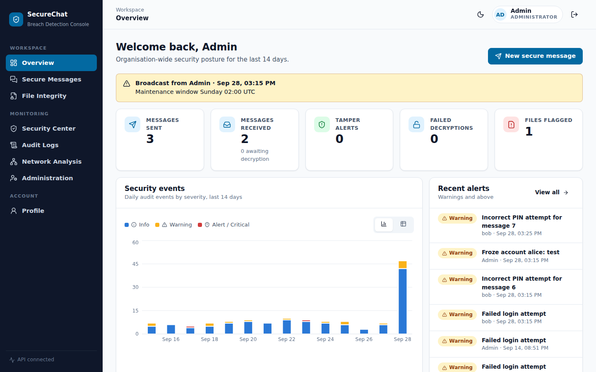
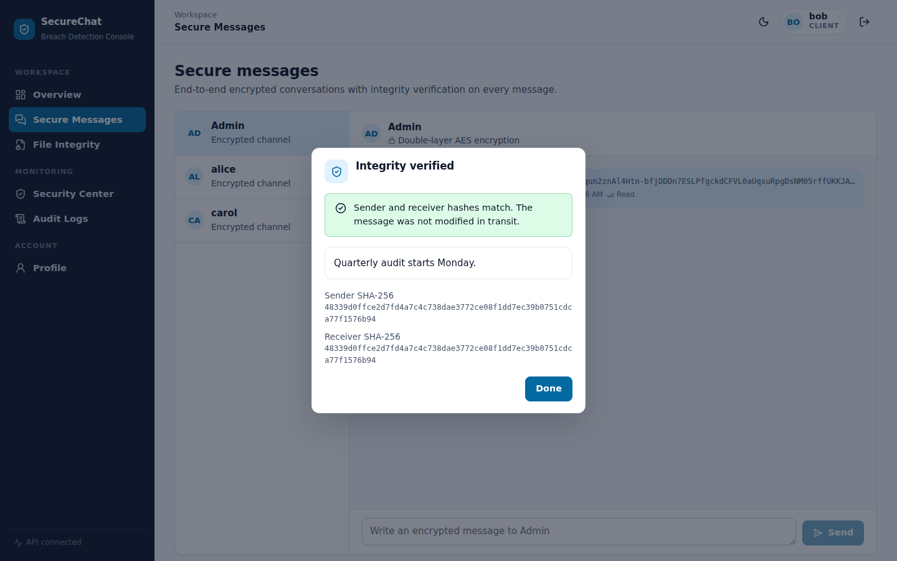
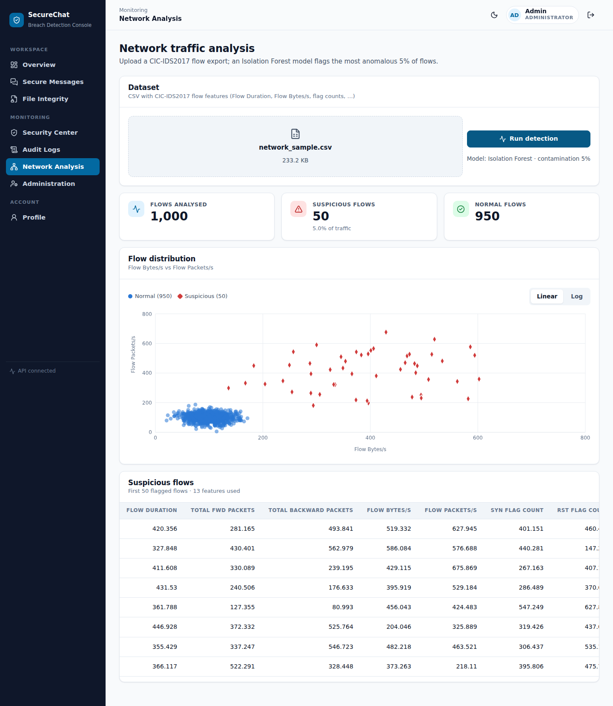
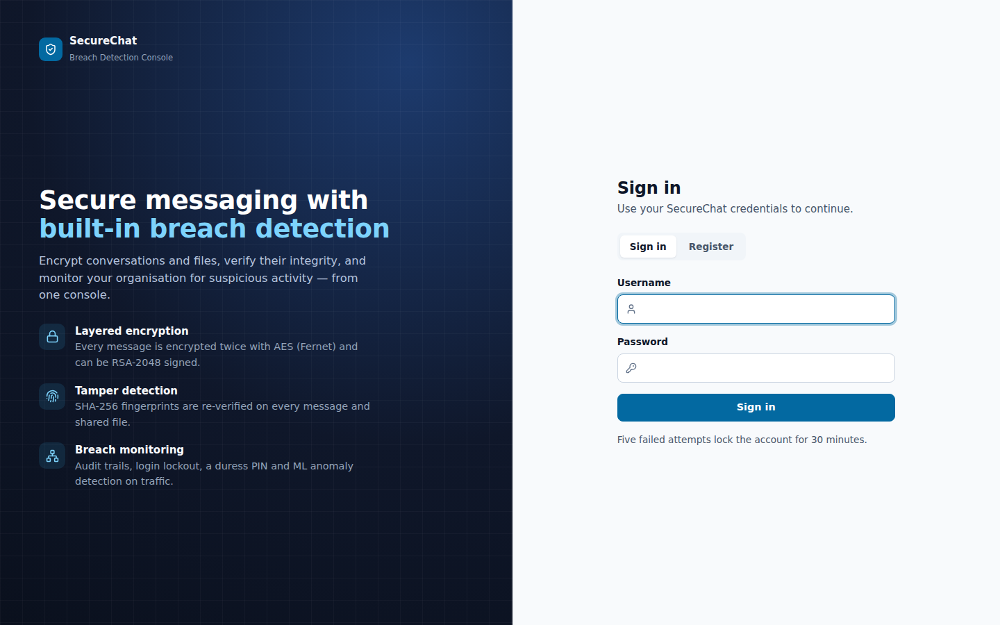
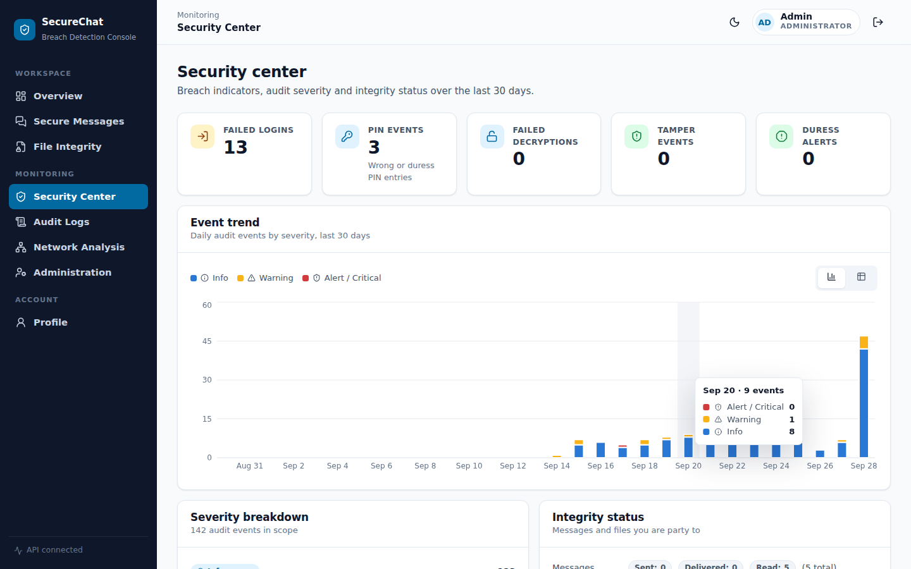
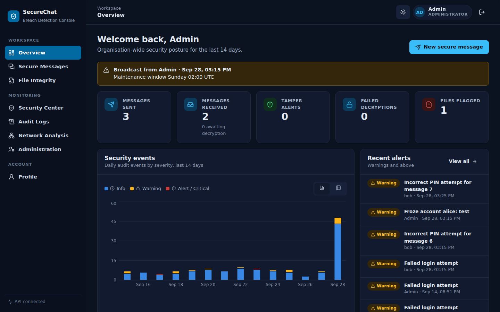
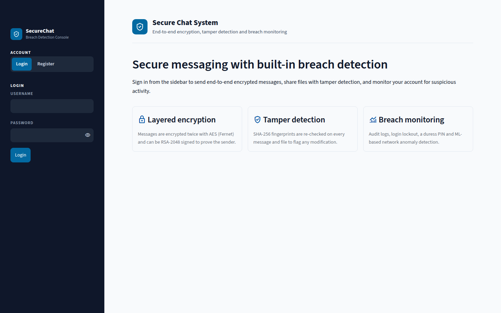
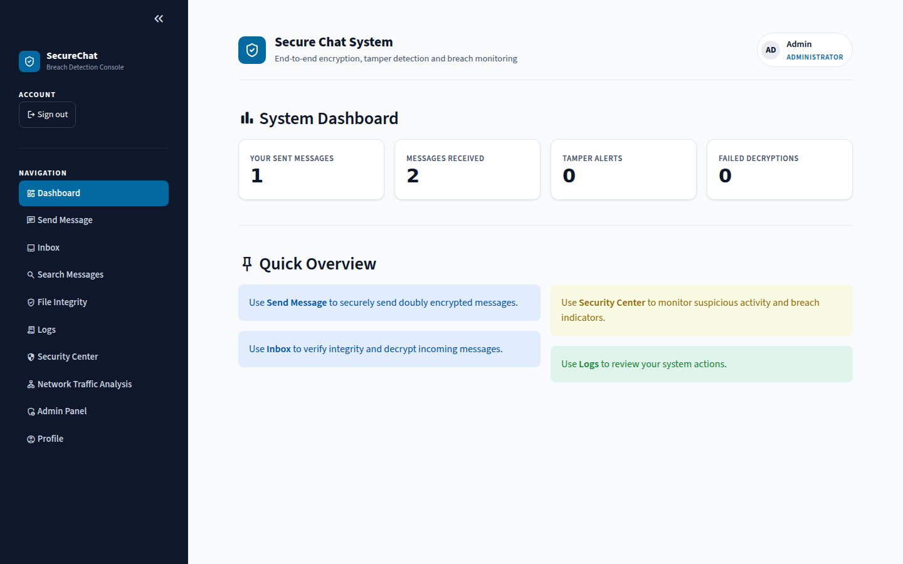
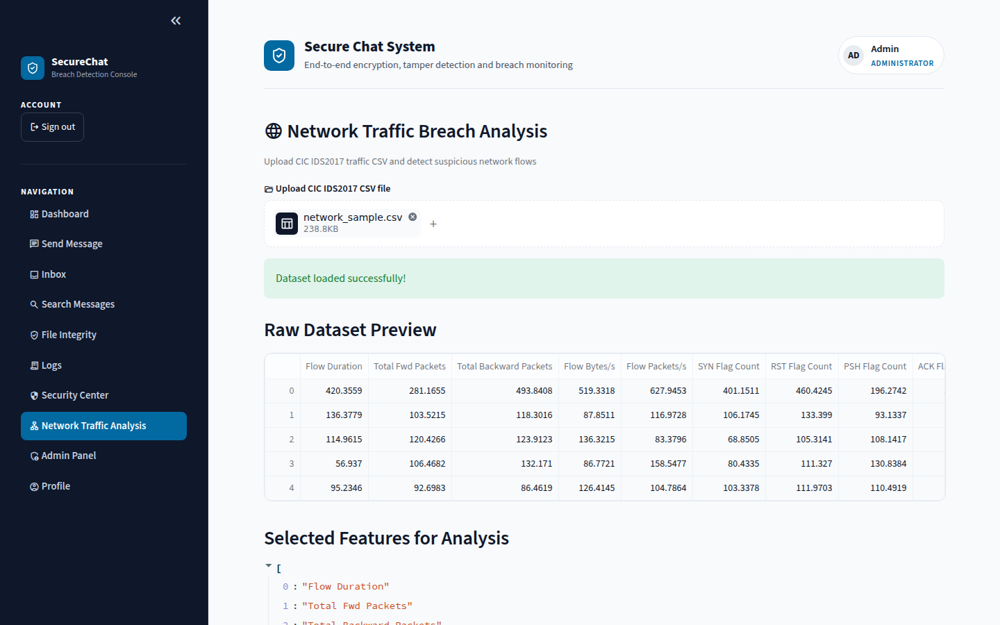

# Security Service Platform

A Python security application combining authentication, cryptographic utilities, file-integrity validation, network analysis, tamper detection, secure messaging, and reporting.

## Highlights

- Authentication and secure messaging
- File-integrity and tamper detection
- Network analysis
- Security reports and audit logging

## React dashboard + Python API

The project ships a professional web dashboard: a **React** single-page app (`frontend/`) backed by a **FastAPI** REST service (`backend/`). The API reuses the original Python modules (`auth`, `crypto_utils`, `database`, `file_integrity`, `network_analysis`, `logger`) and the same SQLite database as the Streamlit app, so both front ends see the same users, messages and logs.

| Overview | Message verification | Network analysis |
|---|---|---|
|  |  |  |
| **Sign in** | **Security center** | **Dark mode** |
|  |  |  |

**Pages:** Overview · Secure Messages · File Integrity · Security Center · Audit Logs · Network Analysis (admin) · Administration (admin) · Profile

### Run it (development)

```bash
# 1. API — from the repository root
pip install -r backend/requirements.txt
python create_admin.py                      # first run only: creates the admin account
uvicorn backend.server:app --reload --port 8000

# 2. Frontend — in a second terminal
cd frontend
npm install
npm run dev                                 # http://localhost:5173 (proxies /api to :8000)
```

### Run it (single process)

```bash
cd frontend && npm install && npm run build && cd ..
uvicorn backend.server:app --port 8000      # serves the built app and the API on http://localhost:8000
```

### Demo build (no backend)

```bash
cd frontend && npm run build:demo           # writes frontend/dist-demo/
```

The demo build answers every `/api` call in the browser with simulated data (`frontend/src/demo/mockApi.js`), so the dashboard can be hosted as static files for a portfolio. Sign in as `Admin` / `Admin@12345` (PIN `1234`) or `bob` / `Demo@1234` (PIN `7390`). The normal build does not include the mock.

### Configuration

| Variable | Purpose | Default |
|---|---|---|
| `SECURITY_API_SECRET` | Signs session tokens. Set it so sessions survive restarts. | random per start |
| `SECURITY_API_TOKEN_TTL` | Session lifetime in seconds | `28800` (8 h) |
| `SECURITY_API_CORS` | Comma-separated allowed origins for the dev server | `http://localhost:5173` |

Interactive API docs are available at `http://localhost:8000/docs`.

## Streamlit app

The original Streamlit interface still works: `streamlit run app.py`.

| Welcome | Dashboard | Network analysis |
|---|---|---|
|  |  |  |

## Design system

Both interfaces follow a clean enterprise ("Minimalism & Swiss") style documented in `design-system/security-service/MASTER.md`, implemented in `frontend/src/styles.css` (React) and `ui_theme.py` + `.streamlit/config.toml` (Streamlit):

- **Colours:** navy `#0F172A` shell, blue `#0369A1` accent, slate neutrals, semantic success / warning / danger tokens
- **Typography:** Plus Jakarta Sans for UI text, JetBrains Mono for hashes and keys
- **Icons:** Material Symbols (`:material/name:`) instead of emoji
- **Dark mode:** the same stylesheet with swapped colour tokens
- **Charts:** severity uses the reserved status colours, always paired with an icon and label, with a table view for every chart

## Technology stack

- **Frontend:** React 19, Vite, React Router, Recharts, Lucide icons
- **Backend:** Python, FastAPI, SQLite, cryptography (Fernet/AES), PyCryptodome (RSA), scikit-learn (Isolation Forest)
- **Legacy UI:** Streamlit

## Repository

- Source: https://github.com/Bhavik7173/Security-Service
- Default branch: `main`

## Portfolio description

A Python security application combining authentication, cryptographic utilities, file-integrity validation, network analysis, tamper detection, secure messaging, and reporting.

## Project status

This repository documents an academic, experimental, earlier-stage, or actively developed project. Review configuration and use fictional data before public deployment. Never commit passwords, API keys, database credentials, or personal information.

## Author

Bhavik Patel - https://github.com/Bhavik7173
